# PetCircle Database Entity-Relationship Diagram

## PlantUML ER Diagram

```plantuml
@startuml PetCircle_Database
!theme plain
skinparam backgroundColor #FEFEFE
skinparam classBackgroundColor #F8F8F8
skinparam classBorderColor #333333
skinparam arrowColor #333333

entity "users" as users {
  * id : UUID <<PK>>
  --
  phone_number : VARCHAR <<UNIQUE>>
  name : VARCHAR
  email : VARCHAR
  address : TEXT
  timezone : VARCHAR
  language : VARCHAR
  onboarding_status : VARCHAR
  is_verified : BOOLEAN
  consent_health : BOOLEAN
  consent_marketing : BOOLEAN
  created_at : TIMESTAMP
  updated_at : TIMESTAMP
}

entity "pets" as pets {
  * id : UUID <<PK>>
  * user_id : UUID <<FK>>
  --
  name : VARCHAR
  species : VARCHAR
  breed : VARCHAR
  date_of_birth : DATE
  weight : NUMERIC
  gender : VARCHAR
  microchip_id : VARCHAR
  life_stage_derived : VARCHAR
  insights : JSONB
  created_at : TIMESTAMP
  updated_at : TIMESTAMP
}

entity "contacts" as contacts {
  * id : UUID <<PK>>
  * user_id : UUID <<FK>>
  --
  contact_type : VARCHAR
  name : VARCHAR
  phone : VARCHAR
  email : VARCHAR
  address : TEXT
  specialization : VARCHAR
  created_at : TIMESTAMP
}

entity "conditions" as conditions {
  * id : UUID <<PK>>
  * pet_id : UUID <<FK>>
  * user_id : UUID <<FK>>
  --
  condition_name : VARCHAR
  severity : VARCHAR
  onset_date : DATE
  status : VARCHAR
  notes : TEXT
  created_at : TIMESTAMP
  updated_at : TIMESTAMP
}

entity "condition_medications" as cond_meds {
  * id : UUID <<PK>>
  * condition_id : UUID <<FK>>
  --
  medicine_name : VARCHAR
  dosage : VARCHAR
  frequency : VARCHAR
  start_date : DATE
  end_date : DATE
  created_at : TIMESTAMP
}

entity "condition_monitoring" as cond_monitor {
  * id : UUID <<PK>>
  * condition_id : UUID <<FK>>
  --
  parameter_name : VARCHAR
  unit : VARCHAR
  frequency : VARCHAR
  notes : TEXT
  created_at : TIMESTAMP
}

entity "preventive_master" as prev_master {
  * id : UUID <<PK>>
  --
  item_name : VARCHAR
  category : VARCHAR
  frequency : VARCHAR
  age_group : VARCHAR
  species : VARCHAR
  breed_specific : BOOLEAN
  created_at : TIMESTAMP
}

entity "preventive_records" as prev_records {
  * id : UUID <<PK>>
  * pet_id : UUID <<FK>>
  * user_id : UUID <<FK>>
  * preventive_item_id : UUID <<FK>>
  --
  due_date : DATE
  completion_date : DATE
  is_completed : BOOLEAN
  is_skipped : BOOLEAN
  created_at : TIMESTAMP
  updated_at : TIMESTAMP
}

entity "custom_preventive_items" as custom_prev {
  * id : UUID <<PK>>
  * pet_id : UUID <<FK>>
  --
  item_name : VARCHAR
  category : VARCHAR
  frequency : VARCHAR
  notes : TEXT
  is_active : BOOLEAN
  created_at : TIMESTAMP
}

entity "reminders" as reminders {
  * id : UUID <<PK>>
  * pet_id : UUID <<FK>>
  * user_id : UUID <<FK>>
  --
  reminder_type : VARCHAR
  item_name : VARCHAR
  due_date : DATE
  next_due_date : DATE
  is_completed : BOOLEAN
  status : VARCHAR
  reminder_stage : VARCHAR
  created_at : TIMESTAMP
  updated_at : TIMESTAMP
}

entity "prescribed_medicines" as prescribed_meds {
  * id : UUID <<PK>>
  * pet_id : UUID <<FK>>
  * user_id : UUID <<FK>>
  --
  medicine_name : VARCHAR
  dosage : VARCHAR
  frequency : VARCHAR
  prescribed_date : DATE
  expiry_date : DATE
  vet_name : VARCHAR
  created_at : TIMESTAMP
}

entity "diagnostic_test_results" as diagnostic {
  * id : UUID <<PK>>
  * pet_id : UUID <<FK>>
  * user_id : UUID <<FK>>
  --
  test_name : VARCHAR
  result_value : VARCHAR
  test_date : DATE
  uploaded_by : VARCHAR
  notes : TEXT
  created_at : TIMESTAMP
}

entity "weight_history" as weight {
  * id : UUID <<PK>>
  * pet_id : UUID <<FK>>
  --
  weight : NUMERIC
  unit : VARCHAR
  recorded_date : DATE
  notes : TEXT
  created_at : TIMESTAMP
}

entity "diet_items" as diet {
  * id : UUID <<PK>>
  * pet_id : UUID <<FK>>
  * user_id : UUID <<FK>>
  --
  food_type : VARCHAR
  quantity : NUMERIC
  unit : VARCHAR
  frequency : VARCHAR
  nutritional_info : JSONB
  is_active : BOOLEAN
  created_at : TIMESTAMP
}

entity "hygiene_preferences" as hygiene {
  * id : UUID <<PK>>
  * pet_id : UUID <<FK>>
  * user_id : UUID <<FK>>
  --
  grooming_frequency : VARCHAR
  bath_schedule : VARCHAR
  grooming_products : JSONB
  special_needs : TEXT
  created_at : TIMESTAMP
}

entity "orders" as orders {
  * id : UUID <<PK>>
  * user_id : UUID <<FK>>
  * pet_id : UUID <<FK>>
  --
  order_date : TIMESTAMP
  expected_delivery : DATE
  total_amount : NUMERIC
  payment_status : VARCHAR
  razorpay_order_id : VARCHAR
  status : VARCHAR
  created_at : TIMESTAMP
}

entity "cart_items" as cart {
  * id : UUID <<PK>>
  * order_id : UUID <<FK>>
  --
  product_id : VARCHAR
  product_type : VARCHAR
  quantity : INTEGER
  price : NUMERIC
  created_at : TIMESTAMP
}

entity "product_food" as prod_food {
  * id : UUID <<PK>>
  --
  name : VARCHAR
  brand : VARCHAR
  category : VARCHAR
  price : NUMERIC
  ingredients : TEXT
  suitable_breeds : JSONB
  health_conditions : JSONB
  created_at : TIMESTAMP
}

entity "product_medicines" as prod_meds {
  * id : UUID <<PK>>
  --
  name : VARCHAR
  active_ingredient : VARCHAR
  dosage : VARCHAR
  price : NUMERIC
  condition_type : VARCHAR
  prescription_required : BOOLEAN
  created_at : TIMESTAMP
}

entity "product_supplement" as prod_supplement {
  * id : UUID <<PK>>
  --
  name : VARCHAR
  type : VARCHAR
  dosage : VARCHAR
  price : NUMERIC
  benefits : TEXT
  suitable_ages : JSONB
  created_at : TIMESTAMP
}

entity "order_recommendations" as order_rec {
  * id : UUID <<PK>>
  * pet_id : UUID <<FK>>
  * user_id : UUID <<FK>>
  --
  product_id : VARCHAR
  product_type : VARCHAR
  recommendation_reason : TEXT
  is_purchased : BOOLEAN
  created_at : TIMESTAMP
}

entity "nudges" as nudges {
  * id : UUID <<PK>>
  * pet_id : UUID <<FK>>
  * user_id : UUID <<FK>>
  --
  nudge_type : VARCHAR
  level : INTEGER
  priority : INTEGER
  content : TEXT
  scheduled_at : TIMESTAMP
  delivered_at : TIMESTAMP
  engagement_status : VARCHAR
  created_at : TIMESTAMP
}

entity "nudge_delivery_log" as nudge_log {
  * id : UUID <<PK>>
  * nudge_id : UUID <<FK>>
  * pet_id : UUID <<FK>>
  * user_id : UUID <<FK>>
  --
  delivery_status : VARCHAR
  delivered_at : TIMESTAMP
  created_at : TIMESTAMP
}

entity "nudge_engagement" as nudge_eng {
  * id : UUID <<PK>>
  * nudge_id : UUID <<FK>>
  * pet_id : UUID <<FK>>
  * user_id : UUID <<FK>>
  --
  engagement_type : VARCHAR
  engaged_at : TIMESTAMP
  created_at : TIMESTAMP
}

entity "pet_ai_insights" as pet_insights {
  * id : UUID <<PK>>
  * pet_id : UUID <<FK>>
  --
  insights : JSONB
  generated_at : TIMESTAMP
  created_at : TIMESTAMP
}

entity "pet_life_stage_traits" as life_traits {
  * id : UUID <<PK>>
  * pet_id : UUID <<FK>>
  --
  breed : VARCHAR
  life_stage : VARCHAR
  traits : JSONB
  created_at : TIMESTAMP
}

entity "pet_preferences" as pet_prefs {
  * id : UUID <<PK>>
  * pet_id : UUID <<FK>>
  --
  preference_key : VARCHAR
  preference_value : VARCHAR
  created_at : TIMESTAMP
}

entity "documents" as documents {
  * id : UUID <<PK>>
  * pet_id : UUID <<FK>>
  * user_id : UUID <<FK>>
  --
  document_type : VARCHAR
  filename : VARCHAR
  file_size : INTEGER
  storage_path : VARCHAR
  gcp_bucket_path : VARCHAR
  extraction_status : VARCHAR
  extracted_data : JSONB
  uploaded_at : TIMESTAMP
}

entity "dashboard_tokens" as dashboard_tokens {
  * id : UUID <<PK>>
  * user_id : UUID <<FK>>
  --
  token : VARCHAR <<UNIQUE>>
  expires_at : TIMESTAMP
  is_revoked : BOOLEAN
  created_at : TIMESTAMP
}

entity "dashboard_visits" as dashboard_visits {
  * id : UUID <<PK>>
  * user_id : UUID <<FK>>
  * pet_id : UUID <<FK>>
  --
  visit_timestamp : TIMESTAMP
  user_agent : TEXT
  created_at : TIMESTAMP
}

entity "conflict_flags" as conflicts {
  * id : UUID <<PK>>
  * user_id : UUID <<FK>>
  --
  conflict_type : VARCHAR
  details : JSONB
  resolution_status : VARCHAR
  expires_at : TIMESTAMP
  created_at : TIMESTAMP
}

entity "agent_order_sessions" as agent_sessions {
  * id : UUID <<PK>>
  * user_id : UUID <<FK>>
  --
  messages : JSONB
  collected_data : JSONB
  is_complete : BOOLEAN
  created_at : TIMESTAMP
  updated_at : TIMESTAMP
}

entity "deferred_care_plan_pending" as deferred_care {
  * id : UUID <<PK>>
  * user_id : UUID <<FK>>
  * pet_id : UUID <<FK>>
  --
  care_plan : JSONB
  pending_items : JSONB
  created_at : TIMESTAMP
}

entity "shown_fun_facts" as fun_facts {
  * id : UUID <<PK>>
  * user_id : UUID <<FK>>
  --
  fact_id : VARCHAR
  shown_at : TIMESTAMP
}

entity "message_logs" as msg_logs {
  * id : UUID <<PK>>
  --
  message_type : VARCHAR
  phone_number : VARCHAR
  content : TEXT
  status : VARCHAR
  created_at : TIMESTAMP
}

entity "whatsapp_template_configs" as wa_templates {
  * id : UUID <<PK>>
  --
  template_name : VARCHAR
  template_params : JSONB
  language : VARCHAR
  created_at : TIMESTAMP
}

' Core relationships
users ||--o{ pets : "owns"
users ||--o{ contacts : "has"
users ||--o{ orders : "places"
users ||--o{ dashboard_tokens : "generates"
users ||--o{ dashboard_visits : "logs"
users ||--o{ agent_sessions : "initiates"
users ||--o{ conflicts : "encounters"
users ||--o{ fun_facts : "views"

' Pet health relationships
pets ||--o{ conditions : "has"
pets ||--o{ prescribed_meds : "takes"
pets ||--o{ diagnostic : "records"
pets ||--o{ weight : "tracks"
pets ||--o{ prev_records : "maintains"
pets ||--o{ custom_prev : "follows"
pets ||--o{ reminders : "receives"
pets ||--o{ diet : "eats"
pets ||--o{ hygiene : "follows"
pets ||--o{ documents : "uploads"

' Condition relationships
conditions ||--o{ cond_meds : "treats with"
conditions ||--o{ cond_monitor : "monitors"

' Preventive relationships
prev_master ||--o{ prev_records : "defines"

' Order relationships
orders ||--o{ cart : "contains"
cart }o--|| prod_food : "references"
cart }o--|| prod_meds : "references"
cart }o--|| prod_supplement : "references"

' Nudge relationships
nudges ||--o{ nudge_log : "logs delivery of"
nudges ||--o{ nudge_eng : "tracks engagement with"

' Pet AI relationships
pets ||--o{ nudges : "receives"
pets ||--o{ pet_insights : "generates"
pets ||--o{ life_traits : "has"
pets ||--o{ pet_prefs : "prefers"
pets ||--o{ order_rec : "recommends for"

' Care plan relationships
pets ||--o{ deferred_care : "defers care for"
pets ||--o{ dashboard_visits : "visits dashboard for"

@enduml
```



---

## ASCII Relationship Map

### Tier 1: Root Users
```
┌─────────────────────┐
│      users          │
│ (phone, onboarding) │
└─────────────────────┘
```

### Tier 2: User-Owned Entities
```
users
├─ pets (1:N) ─────────────────┐
├─ contacts (1:N)              │
├─ orders (1:N)                │
├─ dashboard_tokens (1:N)      │
├─ agent_order_sessions (1:N)  │
├─ conflicts (1:N)             │
├─ fun_facts (1:N)             │
└─ message_logs (indirect)     │
```

### Tier 3: Pet-Related Entities
```
pets
├─ conditions (1:N)
│  ├─ condition_medications (1:N)
│  └─ condition_monitoring (1:N)
│
├─ health_tracking (1:N)
│  ├─ prescribed_medicines
│  ├─ diagnostic_test_results
│  ├─ weight_history
│  └─ pet_ai_insights
│
├─ preventive_care (1:N)
│  ├─ preventive_records → preventive_master
│  └─ custom_preventive_items
│
├─ care_management (1:N)
│  ├─ reminders
│  ├─ diet_items
│  ├─ hygiene_preferences
│  └─ deferred_care_plan
│
├─ ai_insights (1:N)
│  ├─ nudges → nudge_delivery_log, nudge_engagement
│  ├─ pet_life_stage_traits
│  └─ pet_preferences
│
├─ documents (1:N)
│  └─ extracted_data (JSONB)
│
└─ commerce
   └─ order_recommendations
```

### Tier 4: Order & Products
```
orders (user_id)
└─ cart_items (1:N)
   └─ products (N:1)
      ├─ product_food
      ├─ product_medicines
      └─ product_supplement
```

### Tier 5: Analytics & Logs
```
logs
├─ dashboard_visits (user_id, pet_id)
├─ nudge_delivery_log (nudge_id, user_id, pet_id)
├─ nudge_engagement (nudge_id, user_id, pet_id)
└─ message_logs (phone_number, status)
```

---

## Key FK Cardinality

```
users (1) ──┬─ (N) pets
            ├─ (N) contacts
            ├─ (N) conditions
            ├─ (N) preventive_records
            ├─ (N) reminders
            ├─ (N) orders
            ├─ (N) prescribed_medicines
            ├─ (N) diagnostic_test_results
            ├─ (N) diet_items
            ├─ (N) hygiene_preferences
            ├─ (N) documents
            ├─ (N) nudges
            ├─ (N) nudge_delivery_log
            ├─ (N) nudge_engagement
            ├─ (N) dashboard_tokens
            ├─ (N) dashboard_visits
            ├─ (N) deferred_care_plan_pending
            ├─ (N) conflict_flags
            └─ (N) agent_order_sessions

pets (1) ──┬─ (N) conditions
           ├─ (N) preventive_records
           ├─ (N) prescribed_medicines
           ├─ (N) diagnostic_test_results
           ├─ (N) weight_history
           ├─ (N) reminders
           ├─ (N) diet_items
           ├─ (N) hygiene_preferences
           ├─ (N) custom_preventive_items
           ├─ (N) documents
           ├─ (N) nudges
           ├─ (N) pet_ai_insights
           ├─ (N) pet_life_stage_traits
           ├─ (N) pet_preferences
           ├─ (N) order_recommendations
           ├─ (N) dashboard_visits
           ├─ (N) deferred_care_plan_pending
           └─ (N) orders (optional)

preventive_master (1) ── (N) preventive_records

conditions (1) ──┬─ (N) condition_medications
                 └─ (N) condition_monitoring

nudges (1) ──┬─ (N) nudge_delivery_log
             └─ (N) nudge_engagement

orders (1) ── (N) cart_items
```

---

## Domain Clustering

### Health Domain (Isolated)
- conditions
- condition_medications
- condition_monitoring
- prescribed_medicines
- diagnostic_test_results
- weight_history
- pet_ai_insights
- pet_life_stage_traits

**Cross-domain:** Links to pets and users

### Preventive Domain (Frozen Reference)
- preventive_master (read-only catalog)
- preventive_records (user tracking)
- custom_preventive_items (user additions)
- reminders (user notifications)

**Cross-domain:** Links to preventive_master (frozen), users, pets

### Care Domain
- diet_items
- hygiene_preferences
- reminders (shared with preventive)

**Cross-domain:** Links to users, pets

### Order Domain (Isolated)
- orders
- cart_items
- product_food
- product_medicines
- product_supplement
- order_recommendations
- agent_order_sessions

**Cross-domain:** Links to users, pets (optional)

### AI/Nudge Domain
- nudges
- nudge_delivery_log
- nudge_engagement
- nudge_config (reference)
- nudge_message_library (reference)
- pet_preferences

**Cross-domain:** Links to users, pets

### Access & Dashboard Domain
- dashboard_tokens
- dashboard_visits
- deferred_care_plan_pending
- conflict_flags

**Cross-domain:** Links to users, pets (optional)

### Messaging & Logs (Audit)
- message_logs (phone-based, no FK)
- whatsapp_template_configs (reference)

---

## Join Patterns for Common Queries

### Pet Profile (Dashboard)
```sql
SELECT p.*, 
       COUNT(DISTINCT c.id) as condition_count,
       COUNT(DISTINCT pr.id) as preventive_count,
       COUNT(DISTINCT r.id) as reminder_count,
       MAX(w.recorded_date) as last_weight_date
FROM pets p
LEFT JOIN conditions c ON p.id = c.pet_id
LEFT JOIN preventive_records pr ON p.id = pr.pet_id
LEFT JOIN reminders r ON p.id = r.pet_id
LEFT JOIN weight_history w ON p.id = w.pet_id
WHERE p.user_id = ? AND p.id = ?
GROUP BY p.id;
```

### User Orders with Products
```sql
SELECT o.*, 
       STRING_AGG(ci.product_id, ',') as product_ids,
       SUM(ci.price * ci.quantity) as total
FROM orders o
LEFT JOIN cart_items ci ON o.id = ci.order_id
WHERE o.user_id = ?
GROUP BY o.id
ORDER BY o.order_date DESC;
```

### Nudge Engagement Tracking
```sql
SELECT n.*, 
       COUNT(ndl.id) as delivery_count,
       COUNT(ne.id) as engagement_count
FROM nudges n
LEFT JOIN nudge_delivery_log ndl ON n.id = ndl.nudge_id
LEFT JOIN nudge_engagement ne ON n.id = ne.nudge_id
WHERE n.user_id = ? AND n.pet_id = ?
ORDER BY n.scheduled_at DESC;
```

---

## Data Isolation Boundaries

```
┌─────────────────────────────────────────────────────────────┐
│ user_id = "user-123" (Isolated Data Boundary)              │
├─────────────────────────────────────────────────────────────┤
│                                                              │
│  pets (filtered by user_id)                                │
│  ├─ conditions (filtered by user_id)                       │
│  ├─ preventive_records (filtered by user_id)               │
│  ├─ reminders (filtered by user_id)                        │
│  └─ ... (all other pet-related tables)                     │
│                                                              │
│  contacts (filtered by user_id)                            │
│  orders (filtered by user_id)                              │
│  dashboard_tokens (filtered by user_id)                    │
│  conflict_flags (filtered by user_id)                      │
│                                                              │
└─────────────────────────────────────────────────────────────┘

Security Guarantee: No query should ever cross user_id boundary
```

---

## Performance Optimization Hints

### 1. Always Filter by user_id First
```python
# BAD - Scans entire table
pets = session.query(Pet).filter(Pet.name == "Buddy").all()

# GOOD - Uses index on user_id
pets = session.query(Pet).filter(
    Pet.user_id == current_user_id,
    Pet.name == "Buddy"
).all()
```

### 2. Use Eager Loading for Related Entities
```python
# BAD - N+1 query problem
pets = session.query(Pet).filter(Pet.user_id == uid).all()
for pet in pets:
    print(pet.conditions)  # Extra query per pet

# GOOD - Single query with eager loading
pets = session.query(Pet).filter(Pet.user_id == uid).options(
    selectinload(Pet.conditions),
    selectinload(Pet.reminders)
).all()
```

### 3. Index on Frequently Queried Columns
```sql
-- Already indexed by Migration 017
CREATE INDEX idx_users_phone ON users(phone_number);
CREATE INDEX idx_pets_user_id ON pets(user_id);
CREATE INDEX idx_conditions_pet_id ON conditions(pet_id);
CREATE INDEX idx_reminders_pet_id ON reminders(pet_id);
CREATE INDEX idx_reminders_user_id ON reminders(user_id);
```

---

## Summary

The PetCircle database follows a **user-centric, hierarchical model**:

```
users
 └─ pets (1:N)
     ├─ Health data (N:1 to multiple health tables)
     ├─ Care data (N:1 to care tables)
     ├─ AI insights (N:1 to nudges, traits, preferences)
     └─ Documents (N:1 with extraction)

 └─ Orders (1:N)
     └─ Cart items (1:N)
         └─ Products (N:1 to catalogs)

 └─ Access (1:N)
     └─ Dashboard tokens, visits
```

**Key Principles:**
- ✅ All data scoped to user_id (security boundary)
- ✅ All pet data linked through pet_id
- ✅ Foreign keys maintain referential integrity
- ✅ Frozen reference data (preventive_master, products)
- ✅ JSONB for flexible attributes (insights, preferences)
- ✅ Audit trails (message_logs, dashboard_visits)

